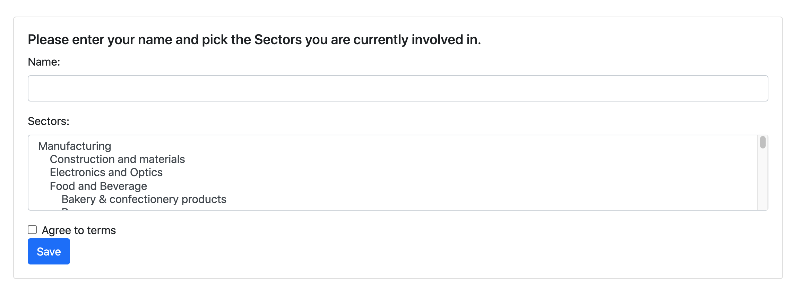

# Survey App



### Getting started
#### Software requirements
- [Docker](https://www.docker.com "Docker")

#### Running the application locally
To start server:
```
docker-compose up -d
```
In browser open:
```
localhost:8080
```

#### Testing
1. Open
    ```
    ./bin
    ```
1. Run
    ```
    docker-compose up -d
    ```
1. Open
    ```
    ./src/main/resources/application.properties
    ```
1. Change the DB strings to:
    ```
    spring.datasource.url=jdbc:postgresql://localhost:5432/survey
    spring.datasource.username=docker
    spring.datasource.password=docker
    ```
1. Run the tests...


### Technical info

FYI Database data and schema files are located in ./bin

Docker multi-stage build have been used to make smaller image for production.\
For session handling I took the ID when the answer was added to the DB and stored it as a session attribute.

### Technologies used:

* [Spring](https://spring.io/projects/spring-boot "Spring")
* [Docker](https://www.docker.com "Docker")

Things I would also like to add later

* CSRF token
